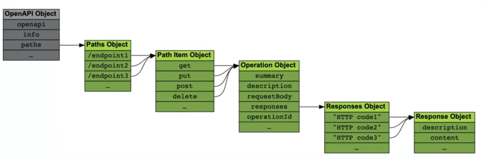

## Unveiling the `Paths` Object: The Heart of Your API's Functionality

The `paths` object within your OpenAPI Specification acts as the central hub for defining your API's functionalities. It's a roadmap that users and developers can follow to understand what actions your API can perform and how to interact with it. Here's a breakdown of the key elements within the `paths` object:

**Structure:**

The `paths` object is a dictionary where the keys represent the API's endpoints (URLs), and the values represent the operations allowed on those endpoints. Endpoints are typically defined as relative URLs relative to the base URL specified in the `servers` object.

**Allowed Operations:**

OpenAPI supports a set of standard HTTP methods that define the type of operation an API call performs on a resource:

* **GET:** Retrieves information from a resource.
* **POST:** Creates a new resource.
* **PUT:** Updates an existing resource entirely.
* **PATCH:** Updates a specific part of an existing resource.
* **DELETE:** Deletes a resource.

**Key Properties:**

* **Operation Object:**  For each endpoint (key) within the `paths` object, you'll define an operation object (value) that specifies details about the allowed HTTP method(s) for that endpoint. Here's what you can include within an operation object:
    * **summary (string):** A brief summary of the operation's purpose.
    * **description (string):** A more detailed explanation of the operation, including use cases and expected behavior. 
    * **requestBody (object):** (Optional) If the operation requires data to be sent in the request body (e.g., for POST or PUT), this object defines the expected data format. 
    * **response (object):** Defines the expected response structure for the operation, including the status code and the data format (e.g., JSON).
    * **operationId (string):** (Optional) A unique identifier for the operation. This can be helpful for machine-readable documentation.

**Example:**

Here's an example of a simple endpoint in the `paths` object:

```yaml
paths:
  /products:  # Endpoint to access products
    get:  # GET operation allowed on this endpoint
      summary: Get all products
      description: Returns a list of all products in the store.
      responses:  # Expected response structure
        '200':  # Status code for successful request
          description: OK
          content:
            application/json:  # Response data format
              schema:
                type: array  # Array of product objects
                items:
                  type: object  # Each item is an object
                  properties:
                    id:
                      type: integer
                      description: Unique identifier for the product
                    name:
                      type: string
                      description: Name of the product
```

**Explanation:**

* This example defines an endpoint `/products` that allows GET requests.
* The `summary` and `description` provide a clear understanding of what the endpoint does.
* The `responses` section defines the expected response for a successful GET request (status code 200) with a JSON-formatted list of products.

**Remember:** The `paths` object is the essence of your API's functionality. By meticulously defining your endpoints and their operations, you create a user-friendly and informative OpenAPI Specification that empowers developers to interact with your API effectively.


